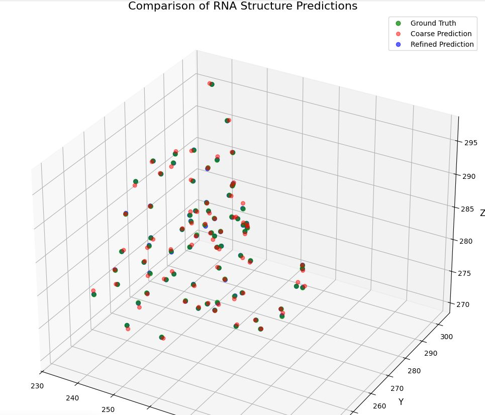
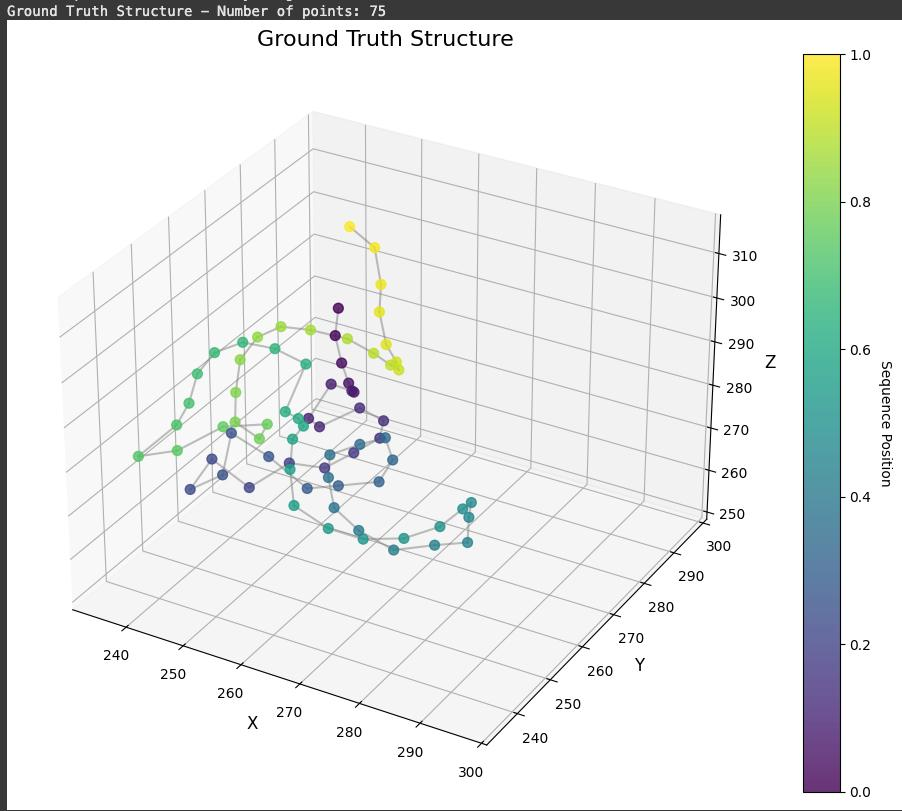
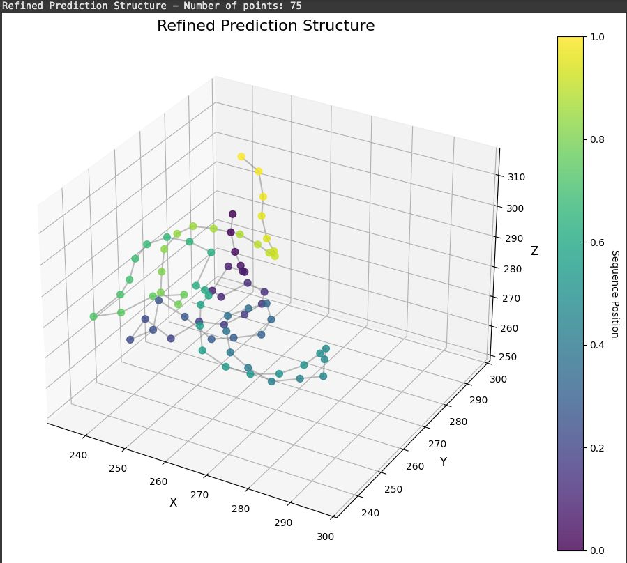
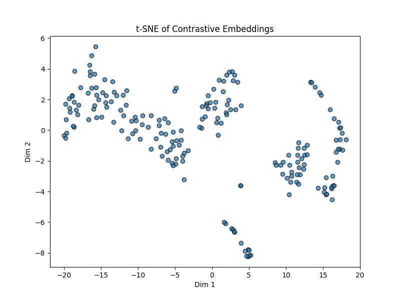
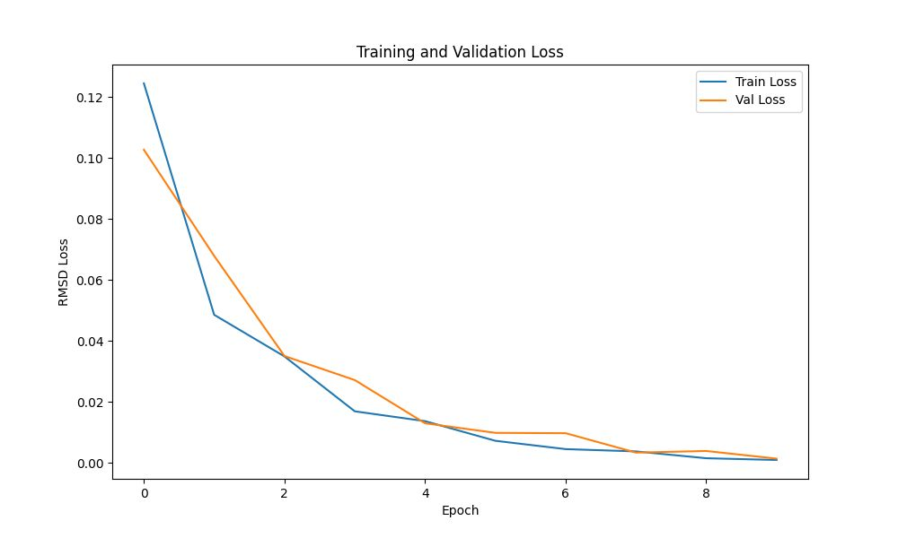
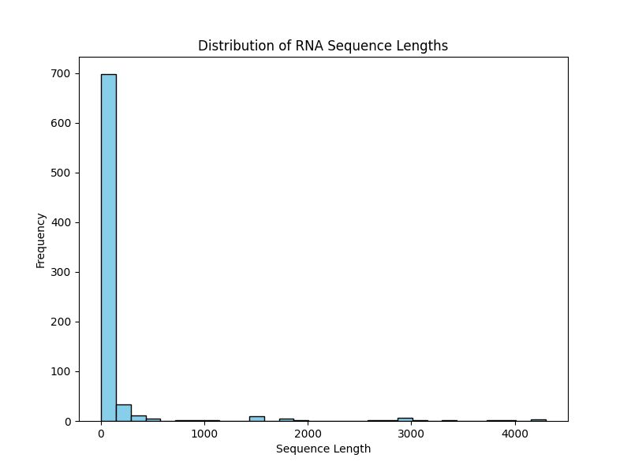
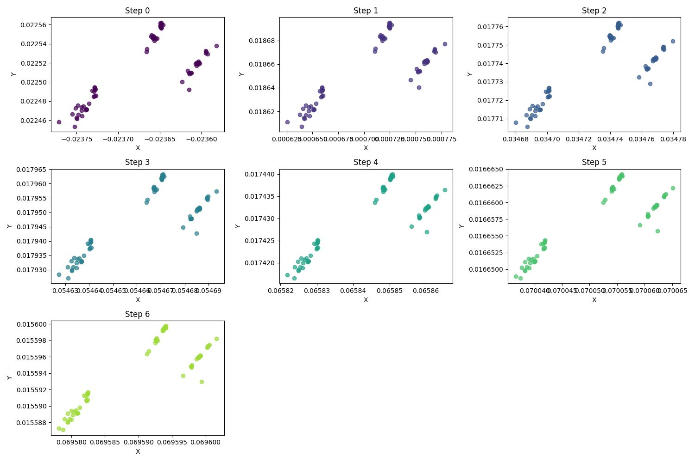
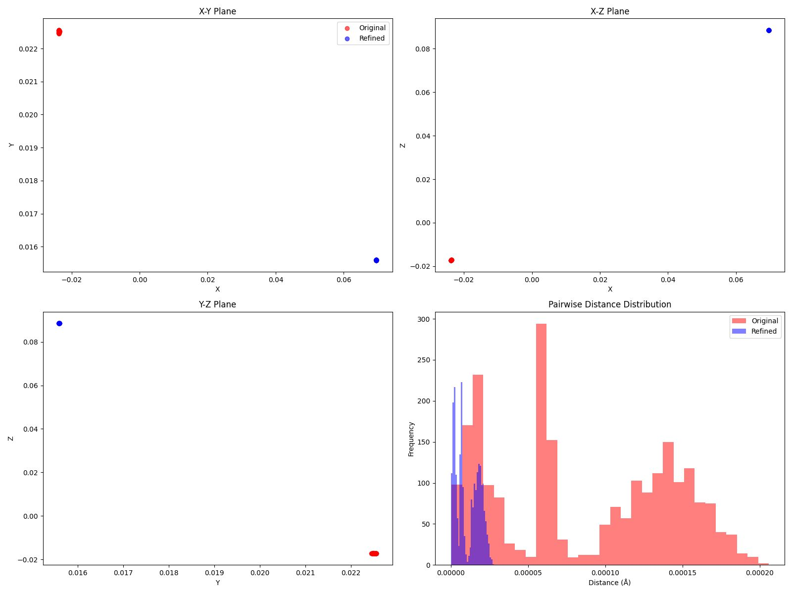

# 🧬 RNA-FoldNet: A Hybrid Graph-Transformer Model with Energy-Based Refinement for RNA 3D Structure Prediction

**A modular deep learning pipeline for RNA tertiary structure prediction** combining contrastive pretraining, graph-transformer modeling, and denoising diffusion refinement — built entirely with **PyTorch** and trained on the **Stanford RNA 3D Folding Dataset**.

> Powered by **GNNs**, **Transformer Attention**, and **DDPM-based denoising**, this architecture bridges sequence and spatial reasoning for high-fidelity RNA 3D structure prediction.

---

## 🚀 Key Features

- **Contrastive Pretraining** on RNA structural triplets using Triplet Loss
- **Graph Transformer Architecture** for coarse 3D coordinate prediction
- **Denoising Diffusion Refinement** for atomic-level accuracy
- **Rotationally Invariant Embeddings** to boost geometric robustness
- **Colab-Ready**, GPU-optimized pipeline

---

## 🛠️ Tech Stack

### 📦 Frameworks & Libraries
- PyTorch · PyTorch Geometric · HuggingFace Transformers
- NumPy · SciPy · pandas · scikit-learn · networkx
- matplotlib · seaborn · plotly · tqdm

### 🧠 Modeling
- GCNConv / GATConv + Multi-head Attention
- Contrastive Encoder with CNN/BiLSTM
- DDPM-based Refinement Model
- Losses: Triplet, RMSD, Denoising Loss

---

## 📊 Visualizations

### 1. **3D Overlay: Ground Truth vs Coarse vs Refined**


### 2. **Color-Mapped Structural Predictions**
- Ground Truth  
  
- Coarse Prediction  
  
- Refined Output  
  

### 3. **t-SNE of Contrastive Embeddings**


### 4. **Training Curves**


### 5. **Sequence Length Distribution**


### 6. **Diffusion Steps**


### 7. **Pairwise Distance Comparison**


---

## 📁 Dataset

- **Source:** [Stanford RNA 3D Folding Dataset (Kaggle)](https://www.kaggle.com/competitions/stanford-rna-3d-folding)
- **Train:** 844 samples
- **Test:** 12 samples
- **Sequence Length:** 3 to 4298 nucleotides

---

## 📈 Performance

| Metric             | Coarse  | Refined |
|--------------------|---------|---------|
| RMSD ↓            | 0.3014  | **0.0692** |
| Pearson Corr ↑    | 0.9996  | **0.99998** |
| Distance Error ↓  | 0.47    | **0.11**   |

---

### 🧪 Training & Inference

All stages — contrastive pretraining, graph-transformer modeling, and diffusion refinement — are implemented in a single Jupyter Notebook.

📘 **RNA_Foldnet.ipynb**

```bash
# Step 1: Launch the notebook
Open RNA_Foldnet.ipynb in Google Colab or Jupyter Notebook

# Step 2: Run all cells
Execute sequentially from data loading to final prediction & plots
```

---

## 📦 Inference

```python
from model.infer import predict_structure

coords = predict_structure(sequence="GAGCGUCUA...")
```

---

## 📌 Authors

- Jyotishman Das  
- Suvadip Chakraborty   
- Denzel Lenshanglen Lupheng 

---

## 🏁 Citation

```
@project{rnafoldnet2025,
  title={RNA-FoldNet: A Hybrid Graph-Transformer Model with Energy-Based Refinement for RNA 3D Structure Prediction},
  author={Das, J. and Chakraborty, S. and Lupheng, D.},
  year={2025},
  note={CSL7590 Deep Learning Project, IIT Jodhpur}
}
```
